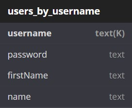
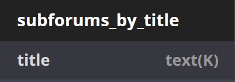
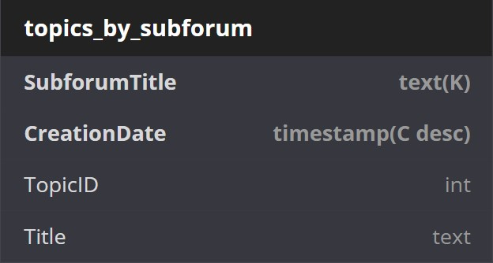
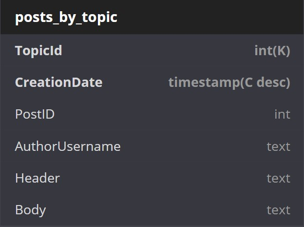
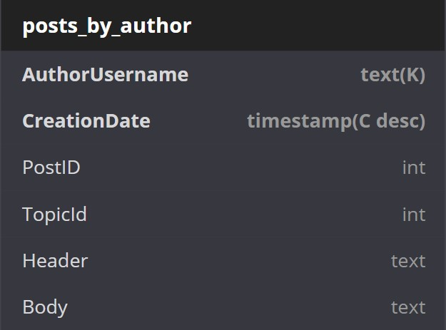

# Modellierung eines Forum in Cassandra

Wir modellieren eine Forum Software. Das Forum besteht aus mehreren Sub-Foren, die wiederum mehrere Topics enthalten können.
Jedes Topic kann mehrere Posts enthalten.

Das ER-Diagram sieht so aus:  


In Cassandra gibt die Art und Weise wie wir Daten holen unsere Datenstruktur vor. Das heißt wir müssen uns vorher Gedanken machen, wie wir unsere Daten brauchen, da eine Änderung des holens meistens eine Änderung des Datenmodells nach sich zieht. 

## Auslegung unserer ``Queries``

### Fälle
Wir haben mehrere Fälle in denen wir Daten aus der Datenbank brauchen:
- Ein Nutzer meldet sich an
- Ein Nutzer will alle Subforen haben
- Ein Nutzer will alle Topics in einem Subforum haben
- Ein Nutzer will alle Posts eines Topics haben
- Ein Nutzer will alle Posts eines Autors haben

## Was brauchen wir in den jeweiligen Fällen?

## Ein Nutzer meldet sich an:  
Wir brauchen seinen Nutzernamen und sein Passwort um die Logindaten zu überprüfen. Das heißt wir sollten eine Tabelle haben, in der nach dem ``Nutzernamen`` Partitioniert wird.

## Ein Nutzer will alle Subforen haben:  
Wir brauchen alle Subforen. Hier ist nichts zu beachten.

## Ein Nutzer will alle Topics in einem Subforum haben:
Wir brauchen alle Topics aus einem Subforum. Das heißt wir sollten eine Tabelle haben, wo wir nach dem ``Primary Key`` des dazugehörigen Subforum partitionieren. Nachher sollen die Topics in Chronologischer Reihenfolge dargestellt werden. Also sortieren wir innerhalb einer Partition nach dem ``Creation Date``. Das wird dann unser ``Clustering Key``

## Ein Nutzer will alle Posts eines Topics haben:
Wir brauchen alle Posts aus einem Topic. Das heißt wir Partitionieren hier, ähnlich wie bei den Topics, nach dem ``Primary Key`` des Topics. Auch hier sollen die Posts nachher Chronologisch dargestellt werden. Also nutzen wir auch hier das Attribut ``Creation Date`` als ``Clustering Key``.

## Ein Nutzer will alle Posts eines Autors haben:
Dies ist sehr ähnlich der Posts nach Topic Tabelle, mit dem Unterschied, dass wir nach dem ``Primary Key`` des Authors partitionieren und nicht nach dem des Topic. Auch hier sollen die Ergebnisse Chronologisch zurückgegeben werden.

# Logische Modell
Für jede Abfrage die wir unterstützen wollen, erstellen wir uns eine Tabelle.

In der Notation ist der Partition Key mit eine ``(K)`` gekennzeichnet.  
Und eine Clustering Column mit eine ``(C <richtung>)``.

## Ein Nutzer meldet sich an:


## Ein Nutzer will alle Subforen haben:  


## Ein Nutzer will alle Topics in einem Subforum haben:


## Ein Nutzer will alle Posts eines Topics haben:  


## Ein Nutzer will alle Posts eines Autors haben:


# Erstellung der Tabellen und des Keyspace

Zunächst erstellen wir uns einen ``Keyspace`` für unsere Anwendung. In dem ``Keyspace`` können wir dann alle ``Tabellen`` erstellen:
```
CREATE KEYSPACE forum WITH replication = {'class': 'SimpleStrategy', 'replication_factor': <node_anzahl>};

USE forum;
```
Hierbei ist zu beachten, dass man für die ``node_anzahl`` die Anzahl der Replikationen angibt. Also auf wievielen ``Nodes`` die gleiche Reihe gespeichert werden soll.

## Ein Nutzer meldet sich an: 
```
CREATE table users_by_username
(
  username text PRIMARY KEY,
  password text,
  firstName text,
  name text,
);
```
## Ein Nutzer will alle Subforen haben:
```
CREATE table subforums_by_title
(
  title text PRIMARY KEY
);
```

## Ein Nutzer will alle Topics in einem Subforum haben:
```
CREATE table topics_by_subforum
(
  SubforumTitle text,
  CreationDate timestamp,
  TopicID int,
  Title text,
  PRIMARY KEY ((SubforumTitle), CreationDate)
)
WITH comment = 'Finds Topics by subforum'
AND CLUSTERING ORDER BY (CreationDate DESC);
```

## Ein Nutzer will alle Posts eines Topics haben:
```
CREATE table posts_by_topic
(
  TopicID int,
  CreationDate timestamp,
  PostID int,
  AuthorUsername text,
  Header text,
  Body text,
  PRIMARY KEY ((TopicID), CreationDate)
)
WITH comment = 'Finds all Posts of Topic'
AND CLUSTERING ORDER BY (CreationDate ASC);
```

## Ein Nutzer will alle Posts eines Autors haben:
```
CREATE table posts_by_author
(
  AuthorUsername text,
  CreationDate timestamp,
  PostID int,
  TopicID int,
  Header text,
  Body text,
  PRIMARY KEY ((AuthorUsername), CreationDate)
)
WITH comment = 'Finds all posts of a author'
AND CLUSTERING ORDER BY (CreationDate DESC);
```

Damit haben wir jetzt alle Tabellen erstellt.

Wie sehen jetzt also unsere Queries in ``CQL`` aus?

# Queries
Beim Start der Anwendung soll sich der Benutzer anmelden. Dafür schickt er uns seinen ``Username`` und sein ``Password`` und wir holen uns seine Daten aus der Datenbank und vergleichen diese:
```
SELECT username, password FROM users_by_username WHERE username='<username>'
```
Ergebnis:
```
 username  | password
-----------+-----------
 username1 | password1
```
<hr>

Dannach wollen wir eine Liste aller Subforen anzeigen. Dafür brauchen wir alle Subforen und deren Titel:
```
SELECT title FROM subforums_by_title;
```
Ergebnis:
```
 title
------------
 Subforum 1
 Subforum 5
 Subforum 6
 Subforum 3
 Subforum 2
 Subforum 4
```
<hr>

Jetzt müssen wir, wenn der Nutzer in ein Subforum geht (z.B. ``Subforum 2``) alle Topics anzeigen:
```
SELECT topicid, title, creationDate from topics_by_subforum WHERE subforumtitle = 'Subforum 2';
```
Ergebnis:
```
 topicid | title           | creationdate
---------+-----------------+---------------------------------
      11 | Topic 1 Forum 2 | 2020-09-23 07:34:16.371000+0000
      10 | Topic 5 Forum 2 | 2020-09-23 07:34:16.369000+0000
       9 | Topic 4 Forum 2 | 2020-09-23 07:34:16.367000+0000
       8 | Topic 3 Forum 2 | 2020-09-23 07:34:16.364000+0000
       7 | Topic 2 Forum 2 | 2020-09-23 07:34:16.362000+0000
       6 | Topic 1 Forum 2 | 2020-09-23 07:34:16.360000+0000
```
<hr>

Jetzt öffnet der Nutzer ein Topic (z.B: Topic ``6``) und will alle Posts innerhalb dieses Topics lesen:
```
SELECT creationdate, authorusername, header, body FROM posts_by_topic WHERE topicid = 6;
```

Ergebnis:
```
 creationdate                    | authorusername | header          | body
---------------------------------+----------------+-----------------+--------------
 2020-09-23 07:40:19.607000+0000 |      username1 |  Post 11 Header | Post 11 Body
 2020-09-23 07:40:20.858000+0000 |      username3 | Post 112 Header | Post 12 Body
```
<hr>

Wenn der Nutzer jetzt z.B. auf den Nutzernamen in einem Post clickt, soll er zum Profil geleitet werden. Also schicken wir ihm die Informationen des Posters:
```
SELECT username, firstname, name FROM users_by_username WHERE username = 'username2';
```
Ergebnis:
```
 username  | firstname | name
-----------+-----------+------
 username2 |      User |  Two
```
<hr>

Und wir wollen im Profil alle Posts des Nutzers anzeigen lassen:
```
SELECT header, body, creationDate, topicID FROM posts_by_author WHERE authorUsername='username2';
```
Ergebnis:
```
 header         | body         | creationdate                    | topicid
----------------+--------------+---------------------------------+---------
 Post 10 Header | Post 10 Body | 2020-09-23 07:40:55.714000+0000 |       5
  Post 8 Header |  Post 8 Body | 2020-09-23 07:40:55.710000+0000 |       4
  Post 5 Header |  Post 5 Body | 2020-09-23 07:40:55.702000+0000 |       3
  Post 2 Header |  Post 2 Body | 2020-09-23 07:40:55.695000+0000 |       1
```
