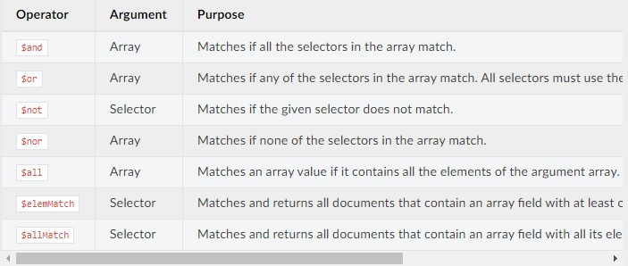

# CouchDB
CouchDBs Fokus liegt klar auf Web Anwendungen. So erlaubt es direkt ``JSON`` zu speichern, seine Dokumente über ``HTTP`` zu bekommen und diese mit ``JavaScript`` zu verändern.
CouchDB erlaubt Replikation und master-master setups mit automatischer Konfliktauflösung. Außerdem bietet CouchDB ``Change Notifications`` an, die über verschiedene Methoden erreichbar sind.

## Prinzip hinter der Datenbank
Ähnlich wie MongoDB ist CouchDB eine Dokumenten Orientierte Datenbank. Es gibt hier allerding so genannte ``Design Documents``. Dies sind besondere Dokumente die Innerhalb einer Datenbank existieren. Sie dienen dem Bauen von Indexen, Validierung von Updates, Formatierung von Query Ergebnissen und Filter Replikation.

## Starten einer Instanz
```bash
docker run -p 5984:5984 -d -e COUCHDB_USER=admin -e COUCHDB_PASSWORD=password couchdb
```

```
curl http://127.0.0.1:5984/
```


## Verbinden zum Web Interface
```
http://localhost:5984/_utils/#login
```

## Alle Datenbanken anzeigen lassen
```
GET /_all_dbs
```
Dies listet uns alle vorhandenen Datenbanken.

## GET Datenbank
```
GET /db
```
Hiermit können wir Metadaten der Datenbank mit dem Namen ``db`` bekommen.

## Alle Dokumente innerhalb einer Datenbank
```
GET /{db}/_all_docs
```
Hiermit bekommen wir alle Dokumente, die in der Datenbank ``db`` sind.


## Innerhalb einer DB suchen
```
POST /{db}/_find
```

Über den request.body.selector können wir dann ein JSON Objekt schicken, welches den Filter enthält.

Beispiel:
```ts
{
  "year": {$gt: 2010}
}
```

## Eine neue Datenbank anlegen
```
PUT /{db}
```
Mit PUT können wir eine neue Datenbank anlegen. Dabei entspricht ``{db}`` dem Datenbanknamen.
Dieser muss mit einem Kleinbuchstaben anfangen, darf nur aus Kleinbuchstaben, Zahlen und  
``_``  
``$``  
``(``  
``)``  
``+``  
``-``  
``/``  
bestehen

## Ein Dokument in einer Datenbank anlegen
```
POST /{db}
```
Im Body der POST Request können wir unsere Daten für das Dokument ablegen.  
Wenn wir ein ``_id`` Feld mitangeben, wird dieses übernommen sofern kein Dokument mit der ``_id`` bereits existiert.  
Falls bereits ein Dokument mit der ``_id`` existiert bekommen wir ein ``409 Conflict``.  
Falls ``_id`` weggelassen wird, dann wird die ID automatisch generiert.

## Ein Dokument über die ``_id`` bekommen
```
GET /{db}/{docid}
```
Hiermit bekommen wir das Dokument mit der _id ``{docid}`` aus der Datenbank ``{db}``

## Ein Dokument über PUT Upserten
```
PUT /{db}/{docid}
```
Hiermit können wir ein Dokument mit der _id ``{id}`` upserten (Update oder Insert). Wenn wir eine Update ausführen wollen, müssen wir enwtweder, die derzeitige Dokument Revision im Request Body mit angeben, als ``rev`` Query Parameter oder im ``If-Match`` Request header.

## Ein Dokument löschen
```
DELETE /{db}/{docid}
```
Hiermit können wir ein Dokument mit der ``{docid}`` aus der Datenbank ``{db}`` löschen. Dabei muss die derzeitige Revision des Dokument mit angegeben werden. Dies kann man über den ``rev`` parameter oder dem ``If-Match`` Header machen.

Dem Dokument wird dann das Feld ``_deleted`` mit dem Wert ``true`` gegeben, damit taucht das Dokument nicht mehr in Queries auf. CouchDB löscht Dokumente nicht vollständig sondern lässt nur sehr Grundlegende Informationen über das Dokument in der Datenbank. Dies wird benötigt um die DELETE Operation auf andere Datenbanken zu replizieren.

## Selectors
Das ``selector`` Feld des Request Bodies wir häufig benötigt und gibt an, welche Kriterien das oder die Dokumente haben sollen, mit dem wir weiter arbeiten wollen.

Das ``selector`` Feld ist dabei ein ``JSON Object``, welches Felder und dazugehörige Filter Werte enthält. Um zum Beispiel alle Dokumente zu finden, die das Feld ``year`` mit dem Wert ``2000`` enthälten. Setzen wir das ``selector`` Feld wie folgt:


```json
"selector": {
  "year": 2000
}
```

Es gibt auch die Möglichkeit mehrere Felder anzugeben. Diese werden dann logisch mit einem ``Und`` Verknüpft. Es müssen also alle ``Feld-Wert`` Paare passen:

```json
"selector": {
  "year": 2000,
  "month": 5
}
```

Hier müssen die Dokumente also im Feld ``year`` den Wert ``2000`` haben UND im Feld ``month`` den Wert ``5``.

### Operatoren:
Es gibt mehrere Operatoren die es uns erlauben den ``selector`` weiter anzupassen. Darunter sind:
- ``$eq`` (Equal)
- ``$gt`` (Greater than)
- ``$gte`` (Greater than equal)
- ``$lt``  (Less than)
- ``$lte`` (Less than equal)
- ``$ne`` (Not Equal)

Es wird empfohlen IMMER einen ``Equality Operator`` als Basis seiner Query zu nehmen. Sonst kann CouchDB nicht mit evtl. vorhandenen Indizes arbeiten und somit müssen alle Dokumente durchsucht werden. Aus der Liste oben sind alle außer der ``$ne`` Operator ``Equality Operator``.

Weitere Operatoren sind:


Ein Beispiel für die Nutzung des ``$or`` Operators:
```json
"selector":{
  "$or": [
    { "year": 2000 },
    { "year": 2005 }
  ]
}
```
Hier würden alle Dokumente zurückgegeben werden, die im ``year`` Feld die Werte ``2000`` oder ``2005`` haben.


### Subfelder
Wir können für Subfelder eine Kurzschreibweise nutzen:  
```json
"selector": {
  "date": {
    "year": 2000
  }
}
```
Können wir mit:
```json
"selector": {
  "date.year": 2000
}
```
abkürzen.

## Sortieren
Mithilfe des ``sort`` Feldes können wir unsere Ergebnisse sortieren.
Das ``sort`` Feld enthält eine Liste an Feldern nach denen sortiert werden soll. Dabei wird zuerst nach dem 1. ``Feld-Richtungs Paar`` sortiert, dann innerhalb dieser Sortierung nach dem 2. und so weiter.

Um nach einem Feld sortieren zu können, muss ein Index auf dem Feld liegen.

Ein Beispiel wie das Feld aussehen könnte, wenn wir nach Jahren, dann Monaten und dann Tagen sortieren wollen:

```json
"sort": [
  { "year": "asc" },
  { "month": "asc" },
  { "day": "asc" }
]
```
Dabei können wir zwischen ``asc`` (Aufsteigend) und ``desc`` (Absteigend) frei wählen. Falls wir ``asc`` sortieren wollen, können wir dies auch weglassen und nur die Felder benennen:
```json
"sort": [
  "year",
  "month",
  "day"
]
```
Dies ist also genau das selbe wie oben.

## Nur bestimmte Felder anzeigen.
Über das ``fields`` Feld können wir angeben, welche Felder zurückgegeben werden sollen. Wenn wir einen Filter anwenden, dann werden auch keine Meta Felder wie ``_id`` zurückgegeben, es sei denn wir geben es explizit an.
```json
"fields": [
  "year", 
  "month"
]
```

So bekommen wir also nur das Feld ``year`` und das Feld ``month`` zurück und keine weiteren Felder.

# Authentication

## Basic Authentication
Dies ist die HTTP Basic Authentication. Dabei wird der ``Authorization: Baisc <password_hash>`` Header bei JEDER Anfrage mitgeschickt.
Diese Methode sollte vermieden werden, da jedes mal das Passwort von CouchDB bearbeitet werden muss.
```
GET / HTTP/1.1
Accept: application/json
Authorization: Basic cm9vdDpyZWxheA==
Host: localhost:5984
```

## Cookie Authentication
CouchDB generiert ein token, das der Client für die nächsten Anfragen nutzen kann. Tokens sind bis ein Timeout valide. Wenn CouchDB ein Valides Token in subsequenten Anfragen sieht, dann wird der Nutzer automatisch Authentifiziert. Standardmäßig sind Cookies 10 minuten Valide.

Das bekommen eines Cookies geht über den ``/_session`` Endpunkt. [Cookie Authentication](https://docs.couchdb.org/en/stable/api/server/authn.html#session)

## Proxy Authentication
Dies ist sehr sinnvoll, wenn man bereits für seine Anwendung ein Authentication Provider hat. Dadurch erspart man sich das doppelte Anlegen von Benutzern.
[Proxy Authentication](https://docs.couchdb.org/en/stable/api/server/authn.html#proxy-authentication)

## JWT Authentication
Mit der JWT Authentication können wir extern generierte JWT (JSON Web Tokens) nutzen anstatt Benutzer mit Rollen un der ``_users`` Datenbank anzulegen. Damit das ganze sicher ist, müssen die JWTs mit einem Key gesigned werden, der in CouchDB hinterlegt ist. 
[JWT Authentication](https://docs.couchdb.org/en/stable/api/server/authn.html#proxy-authentication)

# Design Documents
Design Documents sind unsere Hauptschnittstelle. Mit ihnen können wir ``Views`` erstellen um Informationen aus der Datenbank zu bekommen. Sie werden Identisch zu normalen Dokumenten erstellt, variieren aber in ihrem Inhalt und Definition. Design Documents werden mit ihrer ``ID`` benannt. Diese ``ID`` ist dann Teil der Design Document URL, über welche wir dann den Inhalt der Datenbank erreichen können.

Design Documents erfordern ``JS`` Kenntnisse. Reiche ich gerne nach, wenn benötigt

## Joins
Auch diese benötigen ``JS`` Kenntnisse.