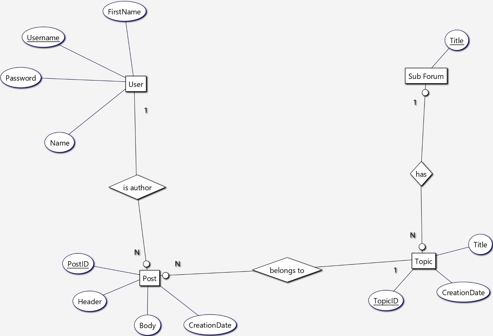
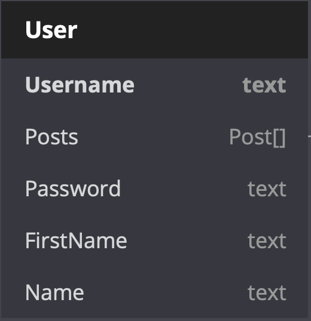
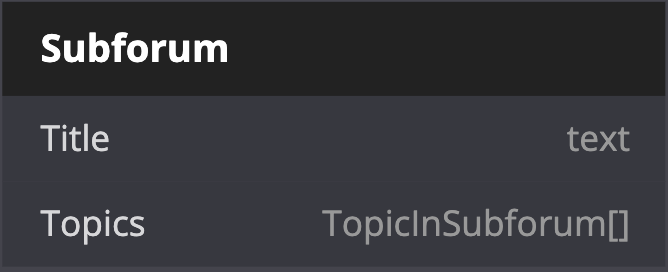
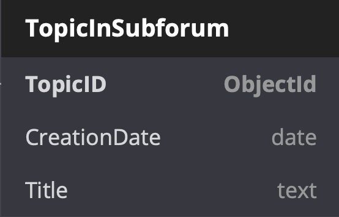
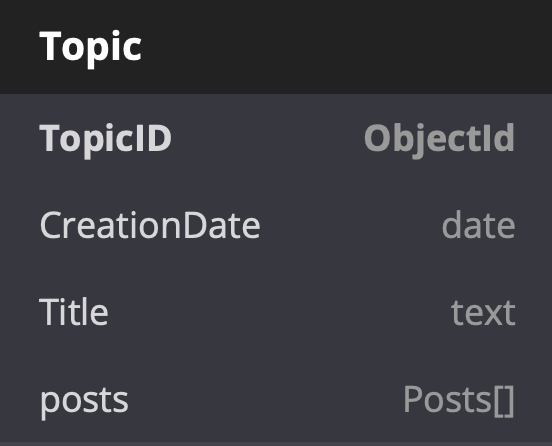
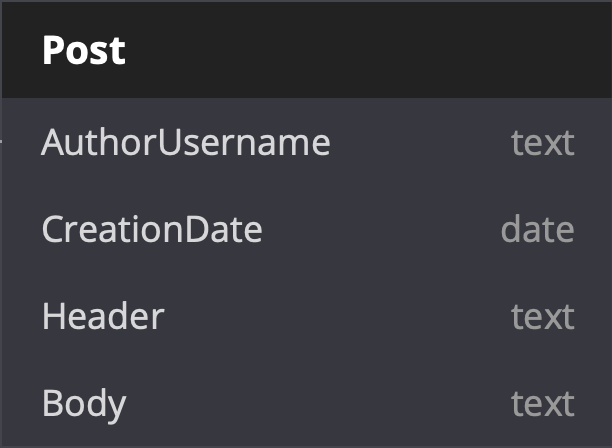
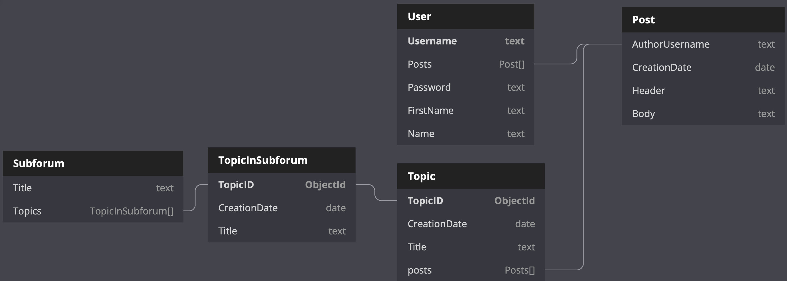

# Modellierung eines Forum in MongoDB

- [Modellierung eines Forum in MongoDB](#modellierung-eines-forum-in-mongodb)
- [Auslegung unserer ``JSON Documents``](#auslegung-unserer-json-documents)
  - [Fälle](#fälle)
    - [Was brauchen wir in den jeweiligen Fällen?](#was-brauchen-wir-in-den-jeweiligen-fällen)
      - [Ein Nutzer meldet sich an:](#ein-nutzer-meldet-sich-an)
      - [Ein Nutzer will alle Subforen haben:](#ein-nutzer-will-alle-subforen-haben)
      - [Ein Nutzer will alle Topics in einem Subforum haben:](#ein-nutzer-will-alle-topics-in-einem-subforum-haben)
      - [Ein Nutzer will alle Posts eines Topics haben:](#ein-nutzer-will-alle-posts-eines-topics-haben)
      - [Ein Nutzer will alle Posts eines Autors haben:](#ein-nutzer-will-alle-posts-eines-autors-haben)
  - [Dokumente](#dokumente)
    - [User](#user)
    - [Subforum](#subforum)
    - [TopicInSubforum](#topicinsubforum)
    - [Topic](#topic)
    - [Post](#post)
    - [Gesamtbild](#gesamtbild)

Wir modellieren eine Forum Software. Das Forum besteht aus mehreren Sub-Foren, die wiederum mehrere Topics enthalten können.
Jedes Topic kann mehrere Posts enthalten.

Das ER-Diagram sieht so aus:  


Mit MongoDB können wir die Struktur in 2 unterschiedliche Art und Weise realisieren:  
- Nested Documents (Wir schreiben z.B. für jedes Subforum nur ein Dokument, dieses enthält dann alle Topics, mit allen Posts)
- Verlinkung über DocumentIDs. (Ziemlich Analog zu relationalen Datenbanken. Wir machen für jede Entität ein eigenes Dokument)

Man kann auch ein Hybrid aus beiden Machen, sodass wir die Joins minimieren (Nested Documents) aber nicht unbedingt immer alles holen müssen (Relational).
Es bietet sich z.B. an, die Posts eines Topics direkt mit in das Topic zu schreiben, da wir eigentlich nie die Posts einzelnd holen wollen. Dann sollten wir auch die Posts jedes Authors in sein Dokument mit reinschreiben. 

Die Topics eines Subforums werden wir aber per DocumentID und in das Subforum verlinken. Außerdem werden wir den Titel des Forums mitschreiben. Das erlaubt es uns alle wichtigen Daten zu bekommen um eine Liste aller Topics im Subforum anzuzeigen, ohne das wir direkt alle Posts mitgeschickt bekommen, was zu einer großen Response führt. Wir brauchen ja nicht alle Posts aus allen Topics des Subforums. Sondern brauchen diese nur, wenn wir uns das Topic angucken wollen. Genau diesen Ansatz werden wir hier verfolgen.

# Auslegung unserer ``JSON Documents``

## Fälle
Wir haben mehrere Fälle in denen wir Daten aus der Datenbank brauchen:
- Ein Nutzer meldet sich an
- Ein Nutzer will alle Subforen haben
- Ein Nutzer will alle Topics in einem Subforum haben
- Ein Nutzer will alle Posts eines Topics haben
- Ein Nutzer will alle Posts eines Autors haben

### Was brauchen wir in den jeweiligen Fällen?

#### Ein Nutzer meldet sich an:  
Wir brauchen seinen Nutzernamen und sein Passwort um die Logindaten zu überprüfen. Wir holen also nur diese Felder.

#### Ein Nutzer will alle Subforen haben:  
Wir brauchen alle Subforen und Grundlegende Informationen zu den Topics in jedem Subforum. Das erlaubt es uns eine Abfrage zu sparen. 

#### Ein Nutzer will alle Topics in einem Subforum haben:
Die Topics haben wir bereits mit der Abfrage der Subforum bekommen und können diese ohne neue Abfrage darstellen.

#### Ein Nutzer will alle Posts eines Topics haben:
Hierfür nutzen wir die TopicID die wir in der Subforum Anfrage bereits bekommen haben um ein Topic Dokument mit mehr Daten zu bekommen. In dieses Dokument schreiben wir auch ein Array an Posts des Topics. Das erlaubt es uns direkt alle Posts anzuzeigen, ohne erneut Anfragen oder sogar ein aufwendingen JOIN zu machen. 

#### Ein Nutzer will alle Posts eines Autors haben:
Dies ist sehr ähnlich der Topics. Wir schreiben in jeden User seine erstellten Posts in ein Array. Dadurch haben wir direkt zugriff auf die Posts. Wenn wir die Posts nicht benötigen, z.B. beim Login, dann lassen wir das Feld bei der Abfrage einfach aus.

## Dokumente

### User

Als JSON:
```ts
{
  username: string,
  password: string,
  firstName: string,
  name: string,
  posts: Post[]
}
```

### Subforum

Als JSON:
```ts
{
  title: string,
  topics: TopicInSubforum[]
}
```

### TopicInSubforum

Als JSON: 
```ts
{
  topicID: number,
  title: string
}
```
### Topic

Als JSON:
```ts
{
  topicID: number,
  creationDate: Date,
  title: string,
  posts: Post[]
}
```

### Post 

Als JSON:
```ts
{
  postID: number,
  creationDate: Date,
  authorUsername: string,
  header: string,
  body: string
}
```

### Gesamtbild
Das Ganze als Gesamtbild:
